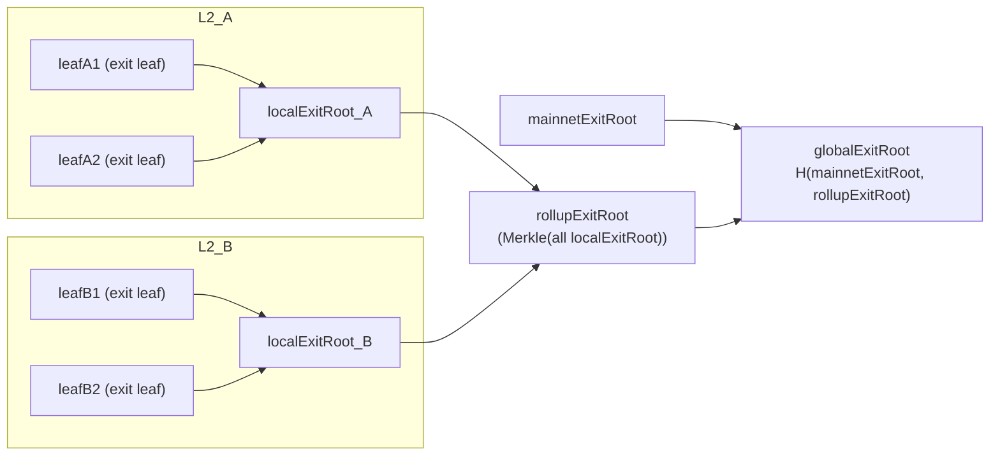

# 退出叶子到 Root 的级联关系

本文用最小模型说明“退出叶子（exit leaf）”到 `localExitRoot`、`rollupExitRoot`、`globalExitRoot` 的级联关系。

## 概念与级联关系

一句话结论：`leaf1/leaf2/...` 先在单条 L2 上聚合为 `localExitRoot`，再把所有 L2 的 `localExitRoot` 聚合为 `rollupExitRoot`，最后与 `mainnetExitRoot` 组合得到 `globalExitRoot`。

- `退出叶子（exit leaf）`：由桥接退出数据按固定字段编码并哈希得到的 Merkle 叶子值。
- `localExitRoot`：单条 L2 的退出树根，由该链的全部退出叶子做 Merkle 聚合得到。
- `rollupExitRoot`：多条 L2 的聚合退出根，由所有 rollup 的 `lastLocalExitRoot` 做 Merkle 聚合得到。
- `globalExitRoot`：全局退出根，由 `mainnetExitRoot` 与 `rollupExitRoot` 组合哈希得到。

按计算顺序：

1. 单链内聚合：`localExitRoot_i = MerkleRoot(leaf1, leaf2, ..., leafn)`
2. 多链聚合：`rollupExitRoot = MerkleRoot(localExitRoot_1, localExitRoot_2, ..., localExitRoot_k)`
3. 全局组合：`globalExitRoot = H(mainnetExitRoot, rollupExitRoot)`

可直观记成：`leaf1/leaf2/... -> localExitRoot(每条L2) -> rollupExitRoot(所有L2) -> globalExitRoot(mainnet+rollup)`。

RPC 字段对照：

- `zkevm_getBatchByNumber.localExitRoot`：该 batch 关联的本链 `localExitRoot`。
- `zkevm_getBatchByNumber.globalExitRoot`：该 batch 关联的 `globalExitRoot`（由 `mainnetExitRoot` 与 `rollupExitRoot` 组合得到）。

来源：

- `agglayer-contracts/contracts/v2/lib/DepositContractV2.sol`：leaf 字段与 `getLeafValue(...)` 计算方式。
- `agglayer-contracts/contracts/v2/PolygonRollupManager.sol`：`getRollupExitRoot()` 使用所有 rollup 的 `lastLocalExitRoot` 聚合。
- `agglayer-contracts/contracts/v2/PolygonZkEVMGlobalExitRootV2.sol`：`globalExitRoot` 由 `mainnetExitRoot` 与 `rollupExitRoot` 组合计算。

## 最小示例

假设 L2-A 的退出叶子为 `leafA1`、`leafA2`，L2-B 的退出叶子为 `leafB1`、`leafB2`，则：

- `localExitRoot_A = MerkleRoot(leafA1, leafA2)`
- `localExitRoot_B = MerkleRoot(leafB1, leafB2)`
- `rollupExitRoot = MerkleRoot(localExitRoot_A, localExitRoot_B)`
- `globalExitRoot = H(mainnetExitRoot, rollupExitRoot)`

在当前实现中，退出叶子来自 `getLeafValue(...)` 对桥接退出数据的哈希，核心字段为 `leafType`、`originNetwork`、`originAddress`、`destinationNetwork`、`destinationAddress`、`amount`、`metadataHash`。
